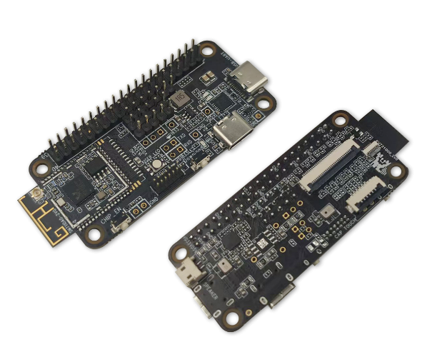
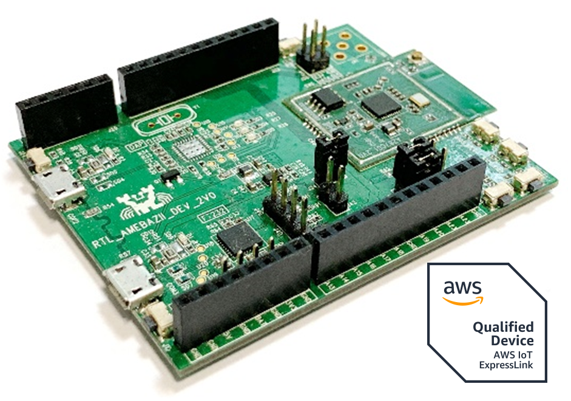

.. raw:: html

   

       <h1>Welcome to Ameba AIoT Documentation Homepage!</h1>
   

.. raw:: html

   

       
   

      

*Product Introduction*
======================

.. tabs::

   .. tab:: AIoT Video SoC/MCU

      .. tabs::

         .. tab:: Ameba Pro2

            .. tabs::

               .. tab:: AMB82-mini

                  .. table::
                     :class: table-transparent
                     :align: center

                     +-----------------------------------------------------------+----------------------------------------------------------+
                     | |img_AMB82_MINI|                                          | - MCU                                                    |
                     |                                                           |    - Part Number: RTL8735B                               |
                     | **AMB82-mini**                                            |    - 32-bit Arm v8M, up to 500MHz                        |
                     |                                                           | - Memory                                                 |
                     | (Ameba RTL8735B)                                          |    - 768KB ROM                                           |
                     |                                                           |    - 512KB RAM                                           |
                     +-----------------------------------------------------------+    - 16MB Flash                                          |
                     | |img_shopping|                                            |    - Supports MCM embedded DDR2/DDR3L memory up to 128MB |
                     |                                                           | - Key Features                                           |
                     | - Worldwide                                               |    - Integrated 802.11 a/b/g/n Wi-Fi, 2.4GHz/5GHz        |
                     |    - `Seeed Studio <link01_AMB82_MINI_>`_                 |    - Bluetooth Low Energy (BLE) 5.1                      |
                     |    - `Amazon <link02_AMB82_MINI_>`_                       |    - Integrated Intelligent Engine @ 0.4 TOPS            |
                     |    - `ICShop <link03_AMB82_MINI_>`_                       |    - USB Host/Device                                     |
                     |    - `ICShop (Module only) <link04_AMB82_MINI_>`_         |    - SD Host                                             |
                     | - Regional                                                |    - ISP                                                 |
                     |    - `Taiwan ICShop <link05_AMB82_MINI_>`_                |    - Audio Codec                                         |
                     |    - `Taiwan ICShop (Module only) <link06_AMB82_MINI_>`_  |    - H.264/H.265 encoder up to 5MP or 1080p @45fps       |
                     |                                                           |    - Secure Boot                                         |
                     |                                                           |    - Crypto Engine                                       |
                     |                                                           | - Other Features                                         |
                     |                                                           |    - 2 SPI interfaces                                    |
                     |                                                           |    - 1 I2C interface                                     |
                     |                                                           |    - 8 PWM interfaces                                    |
                     |                                                           |    - 3 UART interfaces                                   |
                     |                                                           |    - 3 ADC interfaces                                    |
                     |                                                           |    - 2 GDMA interfaces                                   |
                     |                                                           |    - Max 23 GPIOs                                        |
                     +-----------------------------------------------------------+----------------------------------------------------------+

               .. tab:: AMB82

                  .. table::
                     :class: table-transparent
                     :align: center

                     +-----------------------------------------------------------+----------------------------------------------------------+
                     | |img_AMB82|                                               | - MCU                                                    |
                     |                                                           |    - Part Number: RTL8735B                               |
                     | **AMB82**                                                 |    - 32-bit Arm v8M, up to 500MHz                        |
                     |                                                           | - Memory                                                 |
                     | (Ameba RTL8735B)                                          |    - 768KB ROM                                           |
                     |                                                           |    - 512KB RAM                                           |
                     +-----------------------------------------------------------+    - 16MB Flash                                          |
                     |                                                           |    - Supports MCM embedded DDR2/DDR3L memory up to 128MB |
                     |                                                           |    - External Flash up to 64MB                           |
                     |                                                           | - Key Features                                           |
                     |                                                           |    - Integrated 802.11 a/b/g/n Wi-Fi, 2.4GHz/5GHz        |
                     |                                                           |    - Bluetooth Low Energy (BLE) 4.2                      |
                     |                                                           |    - Integrated Intelligent Engine @ 0.4 TOPS            |
                     |                                                           |    - USB Host/Device                                     |
                     |                                                           |    - SD Host                                             |
                     |                                                           |    - ISP                                                 |
                     |                                                           |    - Audio Codec                                         |
                     |                                                           |    - H.264/H.265 encoder up to 5MP or 1080p @45fps       |
                     |                                                           |    - Secure Boot                                         |
                     |                                                           |    - Crypto Engine                                       |
                     |                                                           | - Other Features                                         |
                     |                                                           |    - 2 SPI interfaces                                    |
                     |                                                           |    - 3 I2C interface                                     |
                     |                                                           |    - 12 PWM interfaces                                   |
                     |                                                           |    - 4 UART interfaces                                   |
                     |                                                           |    - 8 ADC interfaces                                    |
                     |                                                           |    - 2 GDMA interfaces                                   |
                     |                                                           |    - Max 59 GPIOs                                        |
                     +-----------------------------------------------------------+----------------------------------------------------------+

         .. tab:: Ameba Pro

            .. tabs::

               .. tab:: AMB81

                  .. table::
                     :class: table-transparent
                     :align: center

                     +-----------------------------------------------------------+----------------------------------------------------------+
                     | |img_AMB81|                                               | - MCU                                                    |
                     |                                                           |    - Part Number: RTL8715AD                              |
                     | **AMB81**                                                 |    - 32-bit Arm v8M, up to 300MHz                        |
                     |                                                           |    - 32-bit Arm®Cortex®-M0, up to 4MHz                   |
                     |                                                           | - Memory                                                 |
                     | (Ameba RTL8715AD / RTL8715AH / RTL8715AQ)                 |    - 512KB RAM                                           |
                     |                                                           |    - 32MB LPDDR                                          |
                     +-----------------------------------------------------------+ - Key Features                                           |
                     |                                                           |    - Integrated 802.11ac/n Wi-Fi SoC                     |
                     |                                                           |    - Trustzone-M Security                                |
                     |                                                           |    - Hardware SSL Engine                                 |
                     |                                                           |    - Root Trust Secure Boot                              |
                     |                                                           |    - USB Host/Device                                     |
                     |                                                           |    - SD Host                                             |
                     |                                                           |    - LCDC                                                |
                     |                                                           |    - Codec                                               |
                     |                                                           |    - ISP                                                 |
                     |                                                           |    - H.264                                               |
                     |                                                           | - Other Features                                         |
                     |                                                           |    - 4 SPI interfaces                                    |
                     |                                                           |    - 5 UART interfaces                                   |
                     |                                                           |    - 2 I2S interface                                     |
                     |                                                           |    - 4 I2C interface                                     |
                     |                                                           |    - 11 ADC interfaces                                   |
                     |                                                           |    - 16 PWM interfaces                                   |
                     |                                                           |    - 2 PCM interfaces                                    |
                     |                                                           |    - Max 90 GPIOs                                        |
                     |                                                           |                                                          |
                     |                                                           | |img_award|                                              |
                     |                                                           | - 2018 COMPUTEX Best Choice Award                        |
                     +-----------------------------------------------------------+----------------------------------------------------------+

   .. tab:: IoT Control SoC/MCU

      .. tabs::

         .. tab:: Ameba D

            .. tabs::

               .. tab:: AMB21 / AMB22

                  .. table::
                     :class: table-transparent
                     :align: center

                     +-----------------------------------------------------+----------------------------------------------------------+
                     | |img_AMB21|                                         | - MCU                                                    |
                     |                                                     |    - Part Number: RTL8722DM                              |
                     | **AMB21 / AMB22**                                   |    - 32-bit KM4 (Arm Cortex-M33 compatible)              |
                     |                                                     |    - 32-bit KM0 (Arm Cortex-M23 compatible)              |
                     | (Ameba RTL8722DM / RTL8722CSM)                      | - Memory                                                 |
                     |                                                     |    - 512KB SRAM                                          |
                     +-----------------------------------------------------+    - 4MB PSRAM                                           |
                     | |img_shopping|                                      |    - 2MB Flash                                           |
                     |                                                     | - Key Features                                           |
                     | - Worldwide                                         |    - Integrated 802.11 a/n Wi-Fi SoC                     |
                     |    - `Seeed Studio <link01_AMB21_AMB22_>`_          |    - Trustzone-M Security                                |
                     | - Regional                                          |    - Hardware SSL Engine                                 |
                     |    - `Taiwan ICShop <link02_AMB21_AMB22_>`_         |    - Root Trust Secure Boot                              |
                     |    - `Mainland China Taobao <link03_AMB21_AMB22_>`_ |    - USB Host/Device                                     |
                     |                                                     |    - SD Host                                             |
                     |                                                     |    - BLE5.0                                              |
                     |                                                     |    - Codec                                               |
                     |                                                     |    - LCDC                                                |
                     |                                                     |    - Key Matrix                                          |
                     |                                                     | - Other Features                                         |
                     |                                                     |    - 1 PCM interface                                     |
                     |                                                     |    - 4 UART interfaces                                   |
                     |                                                     |    - 1 I2S Interface                                     |
                     |                                                     |    - 2 I2C interfaces                                    |
                     |                                                     |    - 7 ADC interfaces                                    |
                     |                                                     |    - 17 PWM interfaces                                   |
                     |                                                     |    - Max 54 GPIOs                                        |
                     |                                                     |                                                          |
                     |                                                     | |img_award|                                              |
                     |                                                     | - 2019 COMPUTEX Best Choice Award                        |
                     +-----------------------------------------------------+----------------------------------------------------------+

               .. tab:: AMB23

                  .. table::
                     :class: table-transparent
                     :align: center

                     +---------------------------------------+----------------------------------------------------------+
                     | |img_AMB23|                           | - MCU                                                    |
                     |                                       |    - Part Number: RTL8722DM                              |
                     | **AMB23**                             |    - 32-bit KM4 (Arm Cortex-M33 compatible)              |
                     |                                       |    - 32-bit KM0 (Arm Cortex-M23 compatible)              |
                     | (Ameba RTL8722DM)                     | - Memory                                                 |
                     |                                       |    - 512KB SRAM                                          |
                     +---------------------------------------+    - 4MB PSRAM                                           |
                     | |img_shopping|                        |    - 2MB Flash                                           |
                     |                                       | - Key Features                                           |
                     | - Worldwide                           |    - Integrated 802.11 a/n Wi-Fi SoC                     |
                     |    - `Seeed Studio <link01_AMB23_>`_  |    - Trustzone-M Security                                |
                     |    - `Adafruit <link02_AMB23_>`_      |    - Hardware SSL Engine                                 |
                     | - Regional                            |    - Root Trust Secure Boot                              |
                     |    - `Taiwan ICShop <link03_AMB23_>`_ |    - USB Host/Device                                     |
                     |                                       |    - SD Host                                             |
                     |                                       |    - BLE5.0                                              |
                     |                                       |    - Codec                                               |
                     |                                       |    - LCDC                                                |
                     |                                       |    - Key Matrix                                          |
                     |                                       | - Other Features                                         |
                     |                                       |    - 1 PCM interface                                     |
                     |                                       |    - 3 UART interfaces                                   |
                     |                                       |    - 1 I2C Interface                                     |
                     |                                       |    - 7 ADC interfaces                                    |
                     |                                       |    - 1 SPI interfaces                                    |
                     |                                       |    - 9 PWM interfaces                                    |
                     |                                       |    - Max 23 GPIOs                                        |
                     |                                       |    - 1 Switch button                                     |
                     |                                       |    - 2 LED                                               |
                     |                                       |                                                          |
                     |                                       | |img_award|                                              |
                     |                                       | - 2019 COMPUTEX Best Choice Award                        |
                     +---------------------------------------+----------------------------------------------------------+

               .. tab:: AMB25

                  .. table::
                     :class: table-transparent
                     :align: center

                     +-----------------------------------------------------------+----------------------------------------------------------+
                     | |img_AMB25|                                               | - MCU                                                    |
                     |                                                           |    - Part Number: RTL8720DF                              |
                     | **AMB25**                                                 |    - 32-bit KM4 (Arm Cortex-M33 compatible)              |
                     |                                                           |    - 32-bit KM0 (Arm Cortex-M23 compatible)              |
                     | (Ameba RTL8720DF)                                         | - Memory                                                 |
                     |                                                           |    - 512KB SRAM                                          |
                     +-----------------------------------------------------------+    - 4MB Flash                                           |
                     | |img_shopping|                                            | - Key Features                                           |
                     |                                                           |    - Integrated WiFi 4 (802.11 b/g/n 1x1) SoC            |
                     | - Worldwide                                               |    - Dual-band, 2.4GHz or 5GHz                           |
                     |    - `Amazon (EVB) <link01_AMB25_>`_                      |    - Bluetooth LE 5.0                                    |
                     |    - `Amazon (WiFi module) <link02_AMB25_>`_              |    - Bluetooth high-power mode up to 10dB                |
                     |    - `Amazon (WiFi module with antenna) <link03_AMB25_>`_ |    - Low Power Mode                                      |
                     | - Regional                                                |    - Auto Download Mode                                  |
                     |    - `Mainland China Taobao <link04_AMB25_>`_             |    - On-board PCB antenna                                |
                     |                                                           | - Other Features                                         |
                     |                                                           |    - 3 UART interfaces                                   |
                     |                                                           |    - 1 I2C Interface                                     |
                     |                                                           |    - 2 SPI interfaces                                    |
                     |                                                           |    - 12 PWM interfaces                                   |
                     |                                                           |    - 3 ADC   interfaces                                  |
                     |                                                           |    - 1 IR interfaces                                     |
                     |                                                           |    - Max 19 GPIOs                                        |
                     |                                                           |    - TypeC USB port                                      |
                     |                                                           |    - 1 SDIO interface (require adaptor)                  |
                     |                                                           |    - Audio Codec(require external MIC & Speaker)         |
                     |                                                           |    - USB2.0 Host Interface (require adaptor)             |
                     +-----------------------------------------------------------+----------------------------------------------------------+

               .. tab:: AMB26

                  .. table::
                     :class: table-transparent
                     :align: center

                     +-----------------------------------------------------------+----------------------------------------------------------+
                     | |img_AMB26|                                               | - MCU                                                    |
                     |                                                           |    - Part Number: RTL8720DF                              |
                     | **AMB26**                                                 |    - 32-bit KM4 (Arm Cortex-M33 compatible)              |
                     |                                                           |    - 32-bit KM0 (Arm Cortex-M23 compatible)              |
                     | (Ameba RTL8720DF)                                         | - Memory                                                 |
                     |                                                           |    - 512KB SRAM                                          |
                     +-----------------------------------------------------------+    - 4MB Flash                                           |
                     | |img_shopping|                                            | - Key Features                                           |
                     |                                                           |    - Integrated WiFi 4 (802.11 b/g/n 1x1) SoC            |
                     | - Worldwide                                               |    - Dual-band, 2.4GHz or 5GHz                           |
                     |    - `Amazon (EVB) <link01_AMB26_>`_                      |    - Bluetooth LE 5.0                                    |
                     |    - `Amazon (WiFi module) <link02_AMB26_>`_              |    - Bluetooth high-power mode up to 10dB                |
                     |    - `Amazon (WiFi module with antenna) <link03_AMB26_>`_ |    - Low Power Mode                                      |
                     | - Regional                                                |    - Auto Download Mode                                  |
                     |    - `Mainland China Taobao <link04_AMB26_>`_             |    - On-board PCB antenna                                |
                     |                                                           |    - Board Dimensions, 25.4 × 46.6 mm                    |
                     |                                                           | - Other Features                                         |
                     |                                                           |    - 3 UART interfaces                                   |
                     |                                                           |    - 1 I2C Interface                                     |
                     |                                                           |    - 2 SPI interfaces                                    |
                     |                                                           |    - 12 PWM interfaces                                   |
                     |                                                           |    - 3 ADC   interfaces                                  |
                     |                                                           |    - 1 IR interfaces                                     |
                     |                                                           |    - Max 18 GPIOs                                        |
                     |                                                           |    - TypeC USB port                                      |
                     |                                                           |    - 1 SDIO interface (require adaptor)                  |
                     |                                                           |    - Audio Codec (require external MIC & Speaker)        |
                     |                                                           |    - USB2.0 Host Interface (require adaptor)             |
                     +-----------------------------------------------------------+----------------------------------------------------------+

               .. tab:: BW16

                  .. table::
                     :class: table-transparent
                     :align: center

                     +----------------------------------------------------+----------------------------------------------------------+
                     | |img_BW16|                                         | - MCU                                                    |
                     |                                                    |    - Part Number: RTL8720DN                              |
                     | |img_partner_designed|                             |    - 32-bit KM4 (Arm Cortex-M33 compatible)              |
                     |                                                    |    - 32-bit KM0 (Arm Cortex-M23 compatible)              |
                     | **BW16**                                           | - Memory                                                 |
                     |                                                    |    - 512KB SRAM                                          |
                     | (Ameba RTL8720DN)                                  |    - 2MB Flash (Up to 4MB)                               |
                     |                                                    | - Key Features                                           |
                     | by **Ai-Thinker**                                  |    - Integrated 802.11a/n Wi-Fi SoC                      |
                     |                                                    |    - BLE5.0                                              |
                     +----------------------------------------------------+ - Other Features                                         |
                     | |img_shopping|                                     |    - 2 UART interfaces                                   |
                     |                                                    |    - 1 I2C Interface                                     |
                     | - Worldwide                                        |    - 1 ADC interfaces                                    |
                     |    - `Alibaba <link01_BW16_>`_                     |    - 1 SPI interfaces                                    |
                     |    - `Alibaba (Module only) <link02_BW16_>`_       |    - 5 PWM interfaces                                    |
                     | - Regional                                         |    - Max 13 GPIOs                                        |
                     |    - `Taiwan ICShop (Module only) <link03_BW16_>`_ |    - 1 RGB LED                                           |
                     |                                                    |                                                          |
                     |                                                    | |img_award|                                              |
                     |                                                    | - 2019 COMPUTEX Best Choice Award                        |
                     +----------------------------------------------------+----------------------------------------------------------+

               .. tab:: BW16-TypeC

                  .. table::
                     :class: table-transparent
                     :align: center

                     +------------------------------------------------------+----------------------------------------------------------+
                     | |img_BW16_C|                                         | - MCU                                                    |
                     |                                                      |    - Part Number: RTL8720DN                              |
                     | |img_partner_designed|                               |    - 32-bit KM4 (Arm Cortex-M33 compatible)              |
                     |                                                      |    - 32-bit KM0 (Arm Cortex-M23 compatible)              |
                     | **BW16 type C**                                      | - Memory                                                 |
                     |                                                      |    - 512KB SRAM                                          |
                     | (Ameba RTL8720DN)                                    |    - 2MB Flash (Up to 4MB)                               |
                     |                                                      | - Key Features                                           |
                     | by **Ai-Thinker**                                    |    - Integrated 802.11a/n Wi-Fi SoC                      |
                     |                                                      |    - BLE5.0                                              |
                     +------------------------------------------------------+    - Auto DownLoad Mode                                  |
                     | |img_shopping|                                       | - Other Features                                         |
                     |                                                      |    - 2 UART interfaces                                   |
                     | - Worldwide                                          |    - 1 I2C Interface                                     |
                     |    - TBD                                             |    - 1 ADC interfaces                                    |
                     | - Regional                                           |    - 1 SPI interfaces                                    |
                     |    - `Taiwan ICShop <link01_BW16_C_>`_               |    - 5 PWM interfaces                                    |
                     |    - `Taiwan ICShop (Module only) <link02_BW16_C_>`_ |    - Max 13 GPIOs                                        |
                     |                                                      |    - 1 RGB LED                                           |
                     |                                                      |    - TypeC USB port                                      |
                     |                                                      |                                                          |
                     |                                                      | |img_award|                                              |
                     |                                                      | - 2019 COMPUTEX Best Choice Award                        |
                     +------------------------------------------------------+----------------------------------------------------------+

               .. tab:: AW-CU488

                  .. table::
                     :class: table-transparent
                     :align: center

                     +-------------------------------------+---------------------------------------------------------------------+
                     | |img_AW-CU488|                      | - MCU                                                               |
                     |                                     |    - Part Number: RTL8721DM                                         |
                     | |img_partner_designed|              |    - 32-bit KM4 (Arm Cortex-M33 compatible)                         |
                     |                                     |    - 32-bit KM0 (Arm Cortex-M23 compatible)                         |
                     | **AW-CU488 Thing Plus**             | - Memory                                                            |
                     |                                     |    - 512KB SRAM                                                     |
                     | (Ameba RTL8721DM)                   |    - 4MB PSRAM                                                      |
                     |                                     |    - 2MB Flash                                                      |
                     | by **SparkFun**                     | - Key Features                                                      |
                     |                                     |    - Integrated 802.11 b/g/n 1x1, 2.4GHz or 5GHz                    |
                     +-------------------------------------+    - Built-in Antenna w/ Internal Shielding Antenna                 |
                     | |img_shopping|                      |    - BLE5.0                                                         |
                     |                                     |    - Audio Codec (MIC & Speaker)                                    |
                     | - Worldwide                         |    - USB2.0 Host Interface                                          |
                     |    - `SparkFun <link01_AW-CU488_>`_ |    - Low Power Mode                                                 |
                     | - Regional                          |    - Auto DownLoad Mode                                             |
                     |    - TBD                            | - Other Features                                                    |
                     |                                     |    - 3 UART interfaces                                              |
                     |                                     |    - 1 I2C Interface                                                |
                     |                                     |    - 7 ADC interfaces                                               |
                     |                                     |    - 2 SPI interfaces                                               |
                     |                                     |    - 11 PWM interfaces                                              |
                     |                                     |    - Max 30 GPIOs                                                   |
                     |                                     |    - 1 LED                                                          |
                     |                                     |    - TypeC USB port                                                 |
                     |                                     |    - LiPo charge with 2-pin JST connector (Charge Rate 500mA/100mA) |
                     |                                     |    - Qwiic connector for I2C devices                                |
                     |                                     |                                                                     |
                     |                                     | |img_award|                                                         |
                     |                                     | - 2019 COMPUTEX Best Choice Award                                   |
                     +-------------------------------------+---------------------------------------------------------------------+

               .. tab:: WE310F5

                  .. table::
                     :class: table-transparent
                     :align: center

                     +------------------------------------------------+---------------------------------------------------------------------+
                     | |img_WE310F5|                                  | - MCU                                                               |
                     |                                                |    - Part Number: RTL8711TTF                                        |
                     | |img_partner_designed|                         |    - 32-bit KM4 (Arm Cortex-M33 compatible)                         |
                     |                                                |    - 32-bit KM0 (Arm Cortex-M23 compatible)                         |
                     | **WE310F5**                                    | - Memory                                                            |
                     |                                                |    - 512KB SRAM                                                     |
                     | (Ameba RTL8711TTF)                             |    - 4MB Flash                                                      |
                     |                                                | - Key Features                                                      |
                     | by **Telit**                                   |    - Integrated 802.11a/n Wi-Fi SoC                                 |
                     |                                                |    - BLE5.0                                                         |
                     +------------------------------------------------+    - Integrated antenna (WE310F5-I) or External Antenna (WE310F5-P) |
                     | |img_shopping|                                 |    - LGA package 18 x 15 mm (-I) / 13.1 x 14.3 (-P)                 |
                     |                                                | - Other Features                                                    |
                     | - Worldwide                                    |    - Hosted (via AT commands) or Standalone (host-less)             |
                     |    - `Telit <link01_WE310F5_>`_                |    - Industrial grade (-40 °C to +85 °C )                           |
                     | - Regional                                     |    - Certified RED/FCC/ISED/RCM                                     |
                     |    - TBD                                       |    - USB2.0 Host Interface                                          |
                     |                                                |    - Low power mode                                                 |
                     |                                                |    - 2 UART interfaces                                              |
                     |                                                |    - 1 I2C Interface                                                |
                     |                                                |    - 1 ADC interfaces                                               |
                     |                                                |    - 1 SPI interfaces                                               |
                     |                                                |    - 1 PWM interfaces                                               |
                     |                                                |    - 1 I2S interfaces                                               |
                     |                                                |    - 1 SDIO interfaces                                              |
                     |                                                |    - Max 29 GPIOs                                                   |
                     +------------------------------------------------+---------------------------------------------------------------------+

               .. tab:: WE310G4

                  .. table::
                     :class: table-transparent
                     :align: center

                     +------------------------------------------------+---------------------------------------------------------------------+
                     | |img_WE310G4|                                  | - MCU                                                               |
                     |                                                |    - Part Number: RTL8720DF                                         |
                     | |img_partner_designed|                         |    - 32-bit KM4 (Arm Cortex-M33 compatible)                         |
                     |                                                |    - 32-bit KM0 (Arm Cortex-M23 compatible)                         |
                     | **WE310G4**                                    | - Memory                                                            |
                     |                                                |    - 512KB SRAM                                                     |
                     | (Ameba RTL8720DF)                              |    - 4MB Flash                                                      |
                     |                                                | - Key Features                                                      |
                     | by **Telit**                                   |    - Integrated 802.11 a/b/g/n Wi-Fi SoC                            |
                     |                                                |    - Support 2.4GHz and 5GHz                                        |
                     +------------------------------------------------+    - BLE5.0                                                         |
                     | |img_shopping|                                 |    - Integrated antenna (WE310F5-I) or External Antenna (WE310F5-P) |
                     |                                                |    - LGA package 18 x 15 mm (-I) / 13.1 x 14.3 (-P)                 |
                     | - Worldwide                                    | - Other Features                                                    |
                     |    - `Telit <link01_WE310G4_>`_                |    - Hosted (via AT commands) or Standalone (host-less)             |
                     | - Regional                                     |    - Industrial grade (-40 °C to +85 °C )                           |
                     |    - TBD                                       |    - Certified RED/FCC/ISED                                         |
                     |                                                |    - P2P Compatible with Telit WE310F5                              |
                     |                                                |    - SDK and Compatible with Telit WE310F5                          |
                     |                                                |    - USB2.0 Host Interface                                          |
                     |                                                |    - Low power mode                                                 |
                     |                                                |    - 2 UART interfaces                                              |
                     |                                                |    - 2 I2C Interface                                                |
                     |                                                |    - 1 ADC interfaces                                               |
                     |                                                |    - 1 SPI interfaces                                               |
                     |                                                |    - 1 PWM interfaces                                               |
                     |                                                |    - 1 I2S interfaces                                               |
                     |                                                |    - 1 SDIO interfaces                                              |
                     +------------------------------------------------+---------------------------------------------------------------------+

               .. tab:: WE20D

                  .. table::
                     :class: table-transparent
                     :align: center

                     +-----------------------------------------+-----------------------------------------------------------------------------------+
                     | |img_WE20D|                             | - MCU                                                                             |
                     |                                         |    - Part Number: RTL8720DF                                                       |
                     | |img_partner_designed|                  |    - 32-bit KM4 (Arm Cortex-M33 compatible)                                       |
                     |                                         |    - 32-bit KM0 (Arm Cortex-M23 compatible)                                       |
                     | **WE20D**                               | - Memory                                                                          |
                     |                                         |    - 512KB SRAM                                                                   |
                     | (Ameba RTL8720DF)                       |    - 4MB Flash                                                                    |
                     |                                         | - Key Features                                                                    |
                     | by **Celium Devices**                   |    - Integrated 802.11 a/b/g/n Wi-Fi and BLE 5.0 Combo module                     |
                     |                                         |    - Integrated antenna (WE20D-C), External Antenna (WE20D-U) or RF Pin (WE20D-R) |
                     +-----------------------------------------+    - Castellations 30 package 21 x 14 mm                                          |
                     | |img_shopping|                          | - Other Features                                                                  |
                     |                                         |    - Hosted (via AT commands) or Standalone (host-less)                           |
                     | - Worldwide                             |    - Industrial grade (-40 °C to +85 °C )                                         |
                     |    - `Celium Devices <link01_WE20D_>`_  |    - USB2.0 Host Interface                                                        |
                     | - Regional                              |    - Low power mode                                                               |
                     |    - TBD                                |    - 3 UART interfaces                                                            |
                     |                                         |    - 2 I2C Interface                                                              |
                     |                                         |    - 1 ADC interfaces                                                             |
                     |                                         |    - 1 SPI interfaces                                                             |
                     |                                         |    - 1 PWM interfaces                                                             |
                     |                                         |    - 1 I2S interfaces                                                             |
                     |                                         |    - 1 SDIO interfaces                                                            |
                     +-----------------------------------------+-----------------------------------------------------------------------------------+

               .. tab:: CMP4010

                  .. table::
                     :class: table-transparent
                     :align: center

                     +-----------------------------------------+---------------------------------------------------------+
                     | |img_CMP4010|                           | - MCU                                                   |
                     |                                         |    - Part Number: RTL8721CSM                            |
                     | |img_partner_designed|                  |    - 32-bit KM4 (Arm Cortex-M33 compatible)             |
                     |                                         |    - 32-bit KM0 (Arm Cortex-M23 compatible)             |
                     | **CMP4010**                             | - Memory                                                |
                     |                                         |    - 512KB SRAM                                         |
                     | (Ameba RTL8721CSM)                      |    - 4MB PSRAM                                          |
                     |                                         |    - 16MB Flash                                         |
                     | by **CEL**                              | - Key Features                                          |
                     |                                         |    - Integrated 802.11 b/g/n Wi-Fi SoC                  |
                     +-----------------------------------------+    - BLE5.0                                             |
                     | |img_shopping|                          | - Other Features                                        |
                     |                                         |    - Hosted (via AT commands) or Standalone (host-less) |
                     | - Worldwide                             |    - Industrial grade (-40 °C to +85 °C )               |
                     |    - `CEL <link01_CMP4010_>`_           |    - Low power mode                                     |
                     | - Regional                              |    - Certified FCC/IC/CE                                |
                     |    - TBD                                |    - Max 35 GPIOs                                       |
                     |                                         |    - USB/UART/SPI/I2C/I2S                               |
                     +-----------------------------------------+---------------------------------------------------------+

               .. tab:: NORA-W30

                  .. table::
                     :class: table-transparent
                     :align: center

                     +------------------------------------------------------+-----------------------------------------------------------------+
                     | |img_NORA-W30|                                       | - MCU                                                           |
                     |                                                      |    - Part Number: RTL8720DF                                     |
                     | |img_partner_designed|                               |    - 32-bit KM4 (Arm Cortex-M33 compatible)                     |
                     |                                                      |    - 32-bit KM0 (Arm Cortex-M23 compatible)                     |
                     | **NORA-W30**                                         | - Memory                                                        |
                     |                                                      |    - 512KB SRAM                                                 |
                     | (Ameba RTL8720DF)                                    |    - 4MB Flash                                                  |
                     |                                                      | - Key Features                                                  |
                     | by **u-blox**                                        |    - Wi-Fi 4 (802.11 a/b/g/n) SoC                               |
                     |                                                      |    - Dual-band, 2.4 and 5 GHz                                   |
                     +------------------------------------------------------+    - Bluetooth LE 5.0                                           |
                     | |img_shopping|                                       |    - Embedded antenna or module pin for external antenna        |
                     |                                                      |    - Small form factor, 10.4 × 14.3 mm                          |
                     | - Worldwide                                          | - Other Features                                                |
                     |    - `u-blox <link01_NORA-W30_>`_                    |    - Powerful open CPU architecture for customized applications |
                     |    - `Mouser Electronics <link02_NORA-W30_>`_        |    - UART, SPI, USB, SDIO, I2C, I2S, PWM, ADC                   |
                     |    - `DigiKey <link03_NORA-W30_>`_                   |    - Pin compatible with other NORA modules                     |
                     | - Regional                                           |    - Global certification                                       |
                     |    - TBD                                             |    - Extended temperature range, -40 °C to +105 °C              |
                     +------------------------------------------------------+-----------------------------------------------------------------+

               .. tab:: NORA-W36

                  .. table::
                     :class: table-transparent
                     :align: center

                     +------------------------------------------------------+-----------------------------------------------------------------+
                     | |img_NORA-W36|                                       | - MCU                                                           |
                     |                                                      |    - Part Number: RTL8720DF                                     |
                     | |img_partner_designed|                               |    - 32-bit KM4 (Arm Cortex-M33 compatible)                     |
                     |                                                      |    - 32-bit KM0 (Arm Cortex-M23 compatible)                     |
                     | **NORA-W36**                                         | - Memory                                                        |
                     |                                                      |    - 512KB SRAM                                                 |
                     | (Ameba RTL8720DF)                                    |    - 4MB Flash                                                  |
                     |                                                      | - Key Features                                                  |
                     | by **u-blox**                                        |    - Wi-Fi 4 (802.11 a/b/g/n) SoC                               |
                     |                                                      |    - Dual-band, 2.4 and 5 GHz                                   |
                     +------------------------------------------------------+    - Bluetooth LE 5.0                                           |
                     | |img_shopping|                                       |    - Embedded antenna or module pin for external antenna        |
                     |                                                      |    - Small form factor, 10.4 × 14.3 mm                          |
                     | - Worldwide                                          | - Other Features                                                |
                     |    - `u-blox <link01_NORA-W36_>`_                    |    - u-connectXpress AT command firmware                        |
                     |    - `Mouser Electronics <link02_NORA-W36_>`_        |    - Pin compatible with other NORA modules                     |
                     |    - `DigiKey <link03_NORA-W36_>`_                   |    - Global certification                                       |
                     | - Regional                                           |    - Extended temperature range, -40 °C to +105 °C              |
                     |    - TBD                                             |                                                                 |
                     +------------------------------------------------------+-----------------------------------------------------------------+

               .. tab:: SI8720DFSTS

                  .. table::
                     :class: table-transparent
                     :align: center

                     +-----------------------------------------+--------------------------------------------------------------------+
                     | |img_SI8720DFSTS|                       | - MCU                                                              |
                     |                                         |    - Part Number: RTL8720DF                                        |
                     | |img_partner_designed|                  |    - 32-bit KM4 (Arm Cortex-M33 compatible)                        |
                     |                                         |    - 32-bit KM0 (Arm Cortex-M23 compatible)                        |
                     | **SI8720DFSTS**                         | - Memory                                                           |
                     |                                         |    - 512KB SRAM                                                    |
                     | (Ameba RTL8720DF)                       |    - 4MB PSRAM                                                     |
                     |                                         |    - 4MB Flash                                                     |
                     | by **SME**                              | - Key Features                                                     |
                     |                                         |    - Integrated 802.11a/b/g/n Wi-Fi SoC                            |
                     +-----------------------------------------+    - Dual-band, 2.4 and 5 GHz                                      |
                     | |img_shopping|                          |    - Trustzone-M Security                                          |
                     |                                         |    - Root Trust Secure Boot                                        |
                     | - Worldwide                             |    - Low Power Mode                                                |
                     |    - `UpArrow <link01_SI8720DFSTS_>`_   |    - BLE5.0                                                        |
                     | - Regional                              | - Other Features                                                   |
                     |    - TBD                                |    - Support multiple host interfaces USB / SDIO / UART / I2C /SPI |
                     +-----------------------------------------+--------------------------------------------------------------------+

               .. tab:: Datalogger

                  .. table::
                     :class: table-transparent
                     :align: center

                     +------------------------------------------------------+-----------------------------------------------------------+
                     | |img_Datalogger|                                     | - MCU                                                     |
                     |                                                      |    - Part Number: RTL8720DF                               |
                     | |img_partner_designed|                               |    - 32-bit KM4 (Arm Cortex-M33 compatible)               |
                     |                                                      |    - 32-bit KM0 (Arm Cortex-M23 compatible)               |
                     | **Datalogger**                                       | - Memory                                                  |
                     |                                                      |    - 512KB SRAM                                           |
                     | (Ameba RTL8720DF)                                    |    - 4MB Flash                                            |
                     |                                                      | - Key Features                                            |
                     | by **Kevin’s Lab**                                   |    - Integrated WiFi 4 (802.11 b/g/n 1x1) SoC             |
                     |                                                      |    - Dual-band, 2.4GHz or 5GHz                            |
                     +------------------------------------------------------+    - Bluetooth LE 5.0                                     |
                     | |img_shopping|                                       |    - Bluetooth high-power mode up to 10dB                 |
                     |                                                      |    - Low Power Mode                                       |
                     | - Worldwide                                          |    - Auto Download Mode                                   |
                     |    - TBD                                             |    - On-board PCB antenna                                 |
                     | - Regional                                           |    - DC IN: 6V ~ 24V                                      |
                     |    - `Taiwan ICShop <link01_Datalogger_>`_           |    - DC OUT: 5V / 1A                                      |
                     |                                                      |    - Arduino Uno mounting holes                           |
                     |                                                      |    - Popular Connectors: qwiic(I2C), UART(JST2.0), RS485  |
                     |                                                      |    - UART expansion                                       |
                     |                                                      |    - RS485 with TVS + PTS protection and 120-ohm resistor |
                     |                                                      | - Other Features                                          |
                     |                                                      |    - 3 UART interfaces                                    |
                     |                                                      |    - 1 I2C interfaces                                     |
                     |                                                      |    - 2 SPI interfaces                                     |
                     |                                                      |    - 12 PWM interfaces                                    |
                     |                                                      |    - 3 ADC interfaces                                     |
                     |                                                      |    - 1 IR interfaces                                      |
                     |                                                      |    - Max 18 GPIOs                                         |
                     +------------------------------------------------------+-----------------------------------------------------------+

         .. tab:: Ameba Smart

            .. table::
               :class: table-transparent
               :align: center

               +-----------------------------------------+------------------------------------------------+
               | |img_AmebaSmart|                        | - MCU                                          |
               |                                         |    - Part Number: RTL8730EAH / RTL8730ELM      |
               | **AmebaSmart**                          |    - Multi-Cores                               |
               |                                         |        - Dual-core Arm Cortex-A32 @1.32GHz     |
               | (Ameba RTL8730EAH / RTL8730ELM)         |        - Arm Cortex-M55 @333MHz                |
               |                                         |        - Arm Cortex-M23 @40MHz                 |
               +-----------------------------------------+ - Memory                                       |
               |                                         |    - Supports NOR or NAND Flash                |
               |                                         |    - Supports PSRAM or DDR Extended Memory     |
               |                                         |    - Up to 256MB RAM (Max.)                    |
               |                                         | - Key Features                                 |
               |                                         |    - 802.11 a/b/g/n/ax 1 x 1, 2.4GHz + 5GHz    |
               |                                         |    - Support Bluetooth 5.3                     |
               |                                         |    - Support Secure Boot & Crypto Engine       |
               |                                         |    - Low Power design                          |
               |                                         |    - Support USB 2.0 OTG                       |
               +-----------------------------------------+------------------------------------------------+

         .. tab:: Ameba Lite

            .. table::
               :class: table-transparent
               :align: center

               +----------------------------------------------+--------------------------------------------------------+
               | |img_AmebaLite|                              | - MCU                                                  |
               |                                              |    - Part Number: RTL8720EAF / RTL8720EAM / RTL8710ECF |
               | **AmebaLite**                                |    - Dual-Cores                                        |
               |                                              |        - Arm Cortex-M55 @400MHz                        |
               | (Ameba RTL8720EAF / RTL8720EAM / RTL8710ECF) |        - RISC-V @400MHz                                |
               |                                              | - Memory                                               |
               +----------------------------------------------+    - Up to 768KB SRAM                                  |
               |                                              |    - Embedded DQ8 PSRAM, up to 200MHz                  |
               |                                              |    - Supports QSPI Flash, up to 100MHz                 |
               |                                              | - Key Features                                         |
               |                                              |    - 802.11 b/g/n/ax 1 x 1, 2.4GHz                     |
               |                                              |    - Support MCS0 - MCS9 20MHz bandwidth               |
               |                                              |    - Support BLE 5.2                                   |
               |                                              |    - Support BLE Mesh 1.1 long Range                   |
               |                                              |    - Support Secure Boot & Crypto Engine               |
               +----------------------------------------------+--------------------------------------------------------+

         .. tab:: Ameba D+

            .. table::
               :class: table-transparent
               :align: center

               +----------------------------------------------+-----------------------------------------------+
               | |img_AmebaD+|                                | - MCU                                         |
               |                                              |    - Part Number:                             |
               | **AmebaD+**                                  |        - RTL8721DAF / RTL8721DAM / RTL8721DCF |
               |                                              |        - RTL8721DCM / RTL8721DGF / RTL8721DG  |
               | (Ameba RTL8721DAF / RTL8721DAM / RTL8721DCF) |    - Dual-Cores                               |
               |                                              |        - Arm Cortex-M55 @345MHz               |
               | (Ameba RTL8721DCM / RTL8721DGF / RTL8721DG)  |        - Arm Cortex-M23@ 115MHz               |
               |                                              | - Memory                                      |
               +----------------------------------------------+    - Up to 512KB SRAM                         |
               |                                              |    - Embedded DQ8 PSRAM, up to 200MHz         |
               |                                              |    - Supports QSPI Flash, up to 104MHz        |
               |                                              | - Key Features                                |
               |                                              |    - 802.11 a/b/g/n 1 x 1, 2.4GHz + 5GHz      |
               |                                              |    - Support MCS0 - MCS7 40MHz bandwidth      |
               |                                              |    - Support BLE 5.0                          |
               |                                              |    - Support BLE Mesh 1.1 Long Range          |
               |                                              |    - Support Secure Boot & Crypto Engine      |
               +----------------------------------------------+-----------------------------------------------+

         .. tab:: Ameba Z2

            .. tabs::

               .. tab:: AMB31

                  .. table::
                     :class: table-transparent
                     :align: center

                     +-----------------------------------------------------+----------------------------------------------------------+
                     | |img_AMB31|                                         | - MCU                                                    |
                     |                                                     |    - Part Number: RTL8720CM                              |
                     | **AMB31**                                           |    - 32-bit Arm®Cortex®-M4, up to 100MHz                 |
                     |                                                     | - Memory                                                 |
                     | (Ameba RTL8720CM)                                   |    - 256KB SRAM                                          |
                     |                                                     |    - 4MB PSRAM                                           |
                     +-----------------------------------------------------+ - Key Features                                           |
                     | |img_shopping|                                      |    - Integrated 802.11n Wi-Fi SoC                        |
                     |                                                     |    - Hardware SSL Engine                                 |
                     | - Worldwide                                         |    - Root Trust Secure Boot                              |
                     |    - `Seeed Studio <link01_AMB31_>`_                |    - BLE4.2                                              |
                     |    - `Good Display <link02_AMB31_>`_                |                                                          |
                     | - Regional                                          |                                                          |
                     |    - `Mainland China Taobao <link03_AMB31_>`_       |                                                          |
                     +-----------------------------------------------------+----------------------------------------------------------+

               .. tab:: AMB31 AWS IoT ExpressLink Devkit

                  .. table::
                     :class: table-transparent
                     :align: center

                     +-----------------------------------------------------+----------------------------------------------------------+
                     | |img_AMB31_AWS|                                     | - MCU                                                    |
                     |                                                     |    - Part Number: RTL8720CM                              |
                     | **AMB31 AWS IoT ExpressLink Devkit**                |    - 32-bit Arm®Cortex®-M4, up to 100MHz                 |
                     |                                                     | - Memory                                                 |
                     | (Ameba RTL8720CM)                                   |    - 256KB SRAM                                          |
                     |                                                     |    - 4MB PSRAM                                           |
                     +-----------------------------------------------------+ - Key Features                                           |
                     | |img_shopping|                                      |    - Integrated 802.11n Wi-Fi SoC                        |
                     |                                                     |    - Hardware SSL Engine                                 |
                     | - Worldwide                                         |    - Root Trust Secure Boot                              |
                     |    - `Seeed Studio <link01_AMB31_AWS_>`_            |    - BLE4.2                                              |
                     | - Regional                                          |    - Support AWS IoT ExpressLink                         |
                     |    - TBD                                            |                                                          |
                     +-----------------------------------------------------+----------------------------------------------------------+

               .. tab:: WE10

                  .. table::
                     :class: table-transparent
                     :align: center

                     +------------------------------------------+---------------------------------------------------------------------------------+
                     | |img_WE10|                               | - MCU                                                                           |
                     |                                          |    - Part Number: RTL8710CF                                                     |
                     | |img_partner_designed|                   |    - 32-bit KM4 (Arm Cortex-M33 compatible)                                     |
                     |                                          |    - 32-bit KM0 (Arm Cortex-M23 compatible)                                     |
                     | **WE10**                                 | - Memory                                                                        |
                     |                                          |    - 256KB SRAM                                                                 |
                     | (Ameba RTL8710CF)                        |    - 2MB Flash                                                                  |
                     |                                          | - Key Features                                                                  |
                     | by **Celium Devices**                    |    - Integrated 802.11 b/g/n Wi-Fi module                                       |
                     |                                          |    - Integrated antenna (WE10-C) , External Antenna (WE10-U) or RF Pin (WE10-R) |
                     +------------------------------------------+    - Castellations 30 package 21 x 14 mm                                        |
                     | |img_shopping|                           | - Other Features                                                                |
                     |                                          |    - Hosted (via AT commands) or Standalone (host-less)                         |
                     | - Worldwide                              |    - Industrial grade (-40 °C to +85 °C )                                       |
                     |    - `Celium Devices <link01_WE10_>`_    |    - Low power mode                                                             |
                     | - Regional                               |    - 3 UART interfaces                                                          |
                     |    - TBD                                 |    - 1 I2C interface                                                            |
                     |                                          |    - 1 SPI interfaces                                                           |
                     |                                          |    - 1 PWM interfaces                                                           |
                     |                                          |    - 1 SDIO interfaces                                                          |
                     +------------------------------------------+---------------------------------------------------------------------------------+

         .. tab:: Ameba Z

            .. tabs::

               .. tab:: AMB11

                  .. table::
                     :class: table-transparent
                     :align: center

                     +-----------------------------------------------------+----------------------------------------------------------+
                     | |img_AMB11|                                         | - MCU                                                    |
                     |                                                     |    - Part Number: RTL8710BN                              |
                     | **AMB11**                                           |    - 32-bit Arm®Cortex®-M4, up to 125MHz                 |
                     |                                                     | - Memory                                                 |
                     | (Ameba RTL8710BN)                                   |    - 256KB RAM                                           |
                     |                                                     | - Key Features                                           |
                     +-----------------------------------------------------+    - Integrated 802.11n Wi-Fi SoC                        |
                     |                                                     |    - Low Power Design                                    |
                     |                                                     |    - XIP                                                 |
                     |                                                     |    - Hardware SSL Engine                                 |
                     |                                                     | - Other Features                                         |
                     |                                                     |    - 1 SPI interfaces                                    |
                     |                                                     |    - 2 UART interfaces                                   |
                     |                                                     |    - 2 I2C interfaces                                    |
                     |                                                     |    - 6 PWM interfaces                                    |
                     |                                                     |    - Max 17 GPIOs                                        |
                     +-----------------------------------------------------+----------------------------------------------------------+

         .. tab:: Ameba 1

            .. tabs::

               .. tab:: AMB01

                  .. table::
                     :class: table-transparent
                     :align: center

                     +-----------------------------------------------------------+------------------------------------------------------------------+
                     | |img_AMB01|                                               | - MCU                                                            |
                     |                                                           |    - Part Number: RTL8195AM                                      |
                     | **AMB01**                                                 |    - 32-bit Arm®Cortex®-M3, up to 166MHz                         |
                     |                                                           | - Memory                                                         |
                     | (Ameba RTL8195AM)                                         |    - 1MB ROM                                                     |
                     |                                                           |    - 2MB SDRAM                                                   |
                     +-----------------------------------------------------------+    - 512KB SRAM                                                  |
                     | |img_shopping|                                            | - Key Features                                                   |
                     |                                                           |    - Integrated with 802.11 b/g/n 1x1 Wi-Fi                      |
                     | - Worldwide                                               |    - NFC Tag with Read/Write Function                            |
                     |    - `Seeed Studio <link01_AMB01_>`_                      |    - 10/100 Ethernet MII/ RMII/RGMII Interface                   |
                     | - Regional                                                |    - USB OTG                                                     |
                     |    - `Taiwan ICShop <link02_AMB01_>`_                     |    - SDIO Device/SD card controller                              |
                     |    - `Singapore 12GEEKS <link03_AMB01_>`_                 |    - Hardware SSL engine                                         |
                     |    - `Australia Little Bird Electronics <link04_AMB01_>`_ |    - 2 SPI Interfaces and support both master and slave mode     |
                     |                                                           |    - 3 UART Interfaces including 2 HS-UART and one log UART      |
                     |                                                           |    - 4 I2C Interfaces and support both master and slave mode     |
                     |                                                           |    - 2 I2S/PCM Interfaces and support both master and slave mode |
                     |                                                           |    - 4 PWM interfaces                                            |
                     |                                                           |    - 2 ADC interfaces                                            |
                     |                                                           |    - 1 DAC interfaces                                            |
                     |                                                           |    - Max 30 GPIOs                                                |
                     |                                                           |                                                                  |
                     |                                                           | |img_award|                                                      |
                     |                                                           | - 2015 COMPUTEX Best Choice Award                                |
                     +-----------------------------------------------------------+------------------------------------------------------------------+

               .. tab:: AMB02

                  .. table::
                     :class: table-transparent
                     :align: center

                     +---------------------------------------+---------------------------------------------------------------+
                     | |img_AMB02|                           | - MCU                                                         |
                     |                                       |    - Part Number: RTL8710AF                                   |
                     | **AMB02**                             |    - 32-bit Arm®Cortex®-M3, up to 83MHz                       |
                     |                                       | - Memory                                                      |
                     | (Ameba RTL8710AF)                     |    - 1MB ROM                                                  |
                     |                                       |    - 512KB SRAM                                               |
                     +---------------------------------------+    - 1MB flash                                                |
                     | |img_shopping|                        | - Key Features                                                |
                     |                                       |    - Integrated with 802.11 b/g/n 1x1 Wi-Fi (HT20 only)       |
                     | - Sold out                            |    - Hardware SSL engine                                      |
                     |                                       |    - 1 SPI Interface and support both master and slave mode   |
                     |                                       |    - 3 UART Interfaces including two HS-UART and one log UART |
                     |                                       |    - 2 I2C Interfaces and support both master and slave mode  |
                     |                                       |    - 4 PWM interfaces                                         |
                     |                                       |    - Max 17 GPIOs                                             |
                     |                                       |                                                               |
                     |                                       | |img_award|                                                   |
                     |                                       | - 2015 COMPUTEX Best Choice Award                             |
                     +---------------------------------------+---------------------------------------------------------------+

.. raw:: html

      

*SDKs & Online Documents*
=========================

.. tabs::

   .. tab:: Arduino

      .. table::
         :align: left

         +-------------------------------------------+---------------------------------------------------------------+
         | Arduino SDKs                              | Arduino Online Documents                                      |
         +===========================================+===============================================================+
         | |img_github_logo_arduino_pro2|            | - `AMB82-mini <link01_doc_Arduino_>`_                         |
         |                                           |                                                               |
         | **Ameba Pro2**                            |                                                               |
         |                                           |                                                               |
         | - `Source Code <link01_GitHub_Arduino_>`_ |                                                               |
         +-------------------------------------------+---------------------------------------------------------------+
         | |img_github_logo_arduino_d|               | - `AMB21 / AMB22 <link02_doc_Arduino_>`_                      |
         |                                           | - `AMB23 <link03_doc_Arduino_>`_                              |
         | **Ameba D**                               | - `AMB25 <link04_doc_Arduino_>`_                              |
         |                                           | - `AMB26 <link05_doc_Arduino_>`_                              |
         | - `Source Code <link02_GitHub_Arduino_>`_ | - `BW16 <link06_doc_Arduino_>`_                               |
         |                                           | - `BW16-TypeC <link07_doc_Arduino_>`_                         |
         |                                           | - `AW-CU488 <link08_doc_Arduino_>`_                           |
         +-------------------------------------------+---------------------------------------------------------------+

   .. tab:: Matter

      `FreeRTOS <https://github.com/Ameba-AIoT/ameba-rtos-matter>`_

      `Linux <https://github.com/Ameba-AIoT/meta-realtek-matter>`_

   .. tab:: FreeRTOS

      .. tabs::

         .. tab:: AmebaSmart/AmebaLite/AmebaLite

            `https://ameba-aiot.github.io/ameba-iot-docs/freertos/en/latest/`_

            `https://ameba-aiot.github.io/ameba-iot-docs/freertos/cn/latest/`_

         .. tab:: AmebaPro2

            `RTL8735B <https://ameba-doc-rtos-pro2-sdk.readthedocs-hosted.com/en/latest/index.html>`_

   .. tab:: Linux

      .. tabs::

         .. tab:: AmebaSmart

            `https://ameba-aiot.github.io/ameba-iot-docs/linux/en/latest/`_

            `https://ameba-aiot.github.io/ameba-iot-docs/linux/cn/latest/`_

.. raw:: html

      

*FAQ and Forum*
===============

- `Ameba IoT FAQ <https://ameba-doc-arduino-sdk.readthedocs-hosted.com/en/latest/FAQ/index.html>`_

- `Ameba IoT Forum <https://forum.amebaiot.com/>`_

- `Ameba IoT Forum FAQ <https://forum.amebaiot.com/c/faq/48>`_

.. |img_background| image:: ./_static/realtek_background_003.png

.. |img_shopping| image:: ./_static/shopping_cart_white.png

.. |img_partner_designed| image:: ./_static/partner_designed_logo.png

.. |img_github_logo_arduino_pro2| image:: ./_static/GitHub_Logo_2025.png
   :target: https://github.com/Ameba-AIoT/ameba-arduino-pro2
   :width:  50px

.. |img_github_logo_arduino_d| image:: ./_static/GitHub_Logo_2025.png
   :target: https://github.com/Ameba-AIoT/ameba-arduino-d
   :width:  50px

.. |img_AMB82_MINI| image:: ./_static/ameba_board_photos/AMB82_MINI.png
   :width:  350px

.. |img_AMB21| image:: ./_static/ameba_board_photos/AMB21.png
   :width:  250px

.. |img_AMB23| image:: ./_static/ameba_board_photos/AMB23.png
   :width:  300px

.. |img_AMB25| image:: ./_static/ameba_board_photos/AMB25.png
   :width:  160px

.. |img_AMB26| image:: ./_static/ameba_board_photos/AMB26.png
   :width:  180px

.. |img_BW16| image:: ./_static/ameba_board_photos/BW16_EVB_module.png
   :width:  150px

.. |img_BW16_C| image:: ./_static/ameba_board_photos/BW16-typec.png
   :width:  150px

.. |img_AW-CU488| image:: ./_static/ameba_board_photos/AW-CU488.png
   :width:  200px

.. |img_WE310G4| image:: ./_static/ameba_board_photos/WE310G4.png
   :width:  200px

.. |img_AMB31| image:: ./_static/ameba_board_photos/AMB31.png
   :width:  200px

.. _link01_AMB82_MINI: https://www.seeedstudio.com/AMB82-MINI-RTL8735B-IoT-AI-Camera-Dev-Board-p-5584.html?queryID=2d6a1efaccf480c882fe1e119a4e6468&objectID=5584&indexName=bazaar_retailer_products

.. _link02_AMB82_MINI: https://www.amazon.com/dp/B0CRYQ84RX?ref=myi_title_dp

.. _link03_AMB82_MINI: https://www.icshop.com.tw/products/368030501864?locale=en

.. _link04_AMB82_MINI: https://ameba-doc-arduino-sdk.readthedocs-hosted.com/en/latest/FAQ/ameba-pro2_module_window.html

.. _link05_AMB82_MINI: https://www.icshop.com.tw/products/368030501864

.. _link06_AMB82_MINI: https://www.icshop.com.tw/products/368030501884?locale=en

.. _link01_AMB21_AMB22: https://www.seeedstudio.com/Ameba-RTL8722DM-IoT-Development-Board-p-4582.html

.. _link02_AMB21_AMB22: https://www.icshop.com.tw/products/368030400103?locale=en

.. _link03_AMB21_AMB22: https://item.taobao.com/item.htm?spm=a312a.7700824.w4004-16130436316.2.795029e7BFUSEJ&id=602797360282&mt

.. _link01_AMB23: https://www.seeedstudio.com/Ameba-RTL8722DM-mini-EVB-Arduino-WiFi-Shield-p-5055.html

.. _link02_AMB23: https://www.adafruit.com/product/5285

.. _link03_AMB23: https://www.icshop.com.tw/products/368030501635?locale=en

.. _link01_AMB25: https://www.amazon.com/RTL8720DF-Dual-Band-Development-Board-PKE8720DF-A00/dp/B0CX8KN8VT

.. _link02_AMB25: https://www.amazon.com/RTL8720DF-Dual-Band-WiFi-Module-PKM8720DF-A00/dp/B0DRTTY5RF/

.. _link03_AMB25: https://www.amazon.com/RTL8720DF-Dual-Band-PKM8720DF-C13-No-Command/dp/B0DSKYWTVW/?th=1

.. _link04_AMB25: https://item.taobao.com/item.htm?id=689621102674&spm=a21xtw.29178619.product_shelf.2.5f2729b2sC1bfp

.. _link01_AMB26: https://www.amazon.com/RTL8720DF-Dual-Band-Development-PKE8720DF-C13-Command/dp/B0CXD5YFD8?th=1

.. _link02_AMB26: https://www.amazon.com/RTL8720DF-Dual-Band-WiFi-Module-PKM8720DF-A00/dp/B0DRTTY5RF/

.. _link03_AMB26: https://www.amazon.com/RTL8720DF-Dual-Band-PKM8720DF-C13-No-Command/dp/B0DSKYWTVW/?th=1

.. _link04_AMB26: https://item.taobao.com/item.htm?id=709899093885&spm=a21xtw.29178619.product_shelf.4.5f2729b2sC1bfp

.. _link01_BW16: https://www.alibaba.com/product-detail/Ai-Thinker-HOT-product-BW16-development_1600305765880.html?spm=a2747.manage.0.0.5a3e71d2bh6AaZ

.. _link02_BW16: https://www.alibaba.com/product-detail/Ai-Thinker-New-product-RTL8720DN-Dual_1600057736344.html?spm=a2747.manage.0.0.9e1971d29X6yof

.. _link03_BW16: https://www.icshop.com.tw/products/368030502076?locale=en

.. _link01_BW16_C: https://www.icshop.com.tw/products/368030501730?locale=en

.. _link02_BW16_C: https://www.icshop.com.tw/products/368030502076?locale=en

.. _link01_AW-CU488: https://www.sparkfun.com/sparkfun-azurewave-thing-plus-aw-cu488.html

.. _link01_WE310F5: https://www.telit.com/contact-us/

.. _link01_WE310G4: https://www.telit.com/contact-us/

.. _link01_WE20D: https://www.celiumdevices.com/support

.. _link01_CMP4010: https://www.cel.com/product/cmp4010/

.. _link01_NORA-W30: https://www.u-blox.com/en/product/nora-w30-series

.. _link02_NORA-W30: https://www.mouser.com/c/?q=Nora-W3

.. _link03_NORA-W30: https://www.digikey.com/en/products/filter/rf-transceiver-modules-and-modems/872?s=N4IgTCBcDaIHIHkBKBBAtAdQMwgLoF8g

.. _link01_NORA-W36: https://www.u-blox.com/en/product/nora-w36-series

.. _link02_NORA-W36: https://www.mouser.com/c/?q=Nora-W3

.. _link03_NORA-W36: https://www.digikey.com/en/products/filter/rf-transceiver-modules-and-modems/872?s=N4IgTCBcDaIHIHkBKBBAtAdQMwgLoF8g

.. _link01_SI8720DFSTS: https://www.uparrow.co.jp/posts/product_archive.html#spb

.. _link01_Datalogger: https://store.makdev.net/collections/developmentboard/products/Datalogger

.. _link01_AMB31: https://www.seeedstudio.com/Ameba-RTL8720CM-IoT-Development-Board-p-4099.html

.. _link02_AMB31: https://buy-lcd.com/development-board-millimeter-wave-radar-smart-home-realtek-amabaz2-rtl8720-cm-wifible42-p0323.html

.. _link03_AMB31: https://item.taobao.com/item.htm?spm=a1z10.1-c.w4004-16130436316.12.109c29e7ONMoQC&id=606572236851

.. _link01_AMB31_AWS: https://www.seeedstudio.com/Ameba-Z2-AWS-IoT-ExpressLink-Dev-kit-p-5546.html

.. _link01_WE10: https://www.celiumdevices.com/support

.. _link01_AMB01: https://www.seeedstudio.com/Ameba-Arduino-Wireless-Board-p-2699.html

.. _link02_AMB01: https://www.icshop.com.tw/products/368030500698?locale=en

.. _link03_AMB01: https://12geeks.com/shop/platforms/ameba/ameba-rtl8195-arduino-wireless-board.html

.. _link04_AMB01: https://littlebirdelectronics.com.au/ameba-rtl8195-arduino-wireless-board

.. _link01_GitHub_Arduino: https://github.com/Ameba-AIoT/ameba-arduino-pro2

.. _link02_GitHub_Arduino: https://github.com/Ameba-AIoT/ameba-arduino-d

.. _link01_doc_Arduino: https://ameba-doc-arduino-sdk.readthedocs-hosted.com/en/latest/ameba_pro2/amb82-mini/index.html

.. _link02_doc_Arduino: https://ameba-doc-arduino-sdk.readthedocs-hosted.com/en/latest/ameba_d/amb21/index.html

.. _link03_doc_Arduino: https://ameba-doc-arduino-sdk.readthedocs-hosted.com/en/latest/ameba_d/amb23/index.html

.. _link04_doc_Arduino: https://ameba-doc-arduino-sdk.readthedocs-hosted.com/en/latest/ameba_d/amb25/index.html

.. _link05_doc_Arduino: https://ameba-doc-arduino-sdk.readthedocs-hosted.com/en/latest/ameba_d/amb26/index.html

.. _link06_doc_Arduino: https://ameba-doc-arduino-sdk.readthedocs-hosted.com/en/latest/ameba_d/bw16-typeb/index.html

.. _link07_doc_Arduino: https://ameba-doc-arduino-sdk.readthedocs-hosted.com/en/latest/ameba_d/bw16-typec/index.html

.. _link08_doc_Arduino: https://ameba-doc-arduino-sdk.readthedocs-hosted.com/en/latest/ameba_d/aw-cu488/index.html
