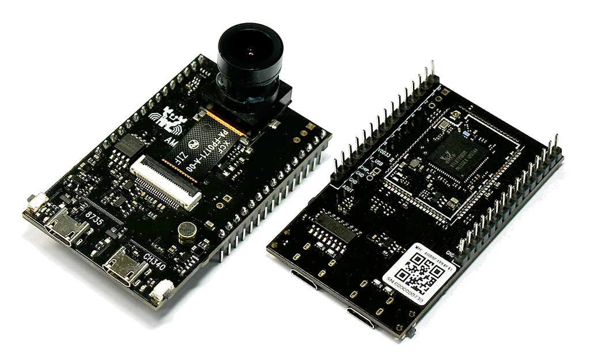

.. raw:: html

   

       <h1>Welcome to Ameba AIoT Documentation Homepage!</h1>
   

.. raw:: html

   

       
   

      

*Product Introduction*
======================

.. tabs::

   .. tab:: AIoT Video SoC/MCU

      .. tabs::

         .. tab:: Ameba Pro2

            .. table::
               :class: table-transparent
               :align: center

               +-----------------------------------------------------------+----------------------------------------------------------+
               | |img_AMB82_MINI|                                          | - MCU                                                    |
               |                                                           |    - Part Number: RTL8735B                               |
               | **AMB82-mini**                                            |    - 32-bit Arm v8M, up to 500MHz                        |
               |                                                           | - Memory                                                 |
               | (Ameba RTL8735B)                                          |    - 768KB ROM                                           |
               |                                                           |    - 512KB RAM                                           |
               +-----------------------------------------------------------+    - 16MB Flash                                          |
               | |img_shopping|                                            |    - Supports MCM embedded DDR2/DDR3L memory up to 128MB |
               |                                                           | - Key Features                                           |
               | - Worldwide                                               |    - Integrated 802.11 a/b/g/n Wi-Fi, 2.4GHz/5GHz        |
               |    - `Seeed Studio <link01_AMB82_MINI_>`_                 |    - Bluetooth Low Energy (BLE) 5.1                      |
               |    - `Amazon <link02_AMB82_MINI_>`_                       |    - Integrated Intelligent Engine @ 0.4 TOPS            |
               |    - `ICShop <link03_AMB82_MINI_>`_                       |    - USB Host/Device                                     |
               |    - `ICShop (Module only) <link04_AMB82_MINI_>`_         |    - SD Host                                             |
               | - Regional                                                |    - ISP                                                 |
               |    - `Taiwan ICShop <link05_AMB82_MINI_>`_                |    - Audio Codec                                         |
               |    - `Taiwan ICShop (Module only) <link06_AMB82_MINI_>`_  |    - H.264/H.265                                         |
               |                                                           |    - Secure Boot                                         |
               |                                                           |    - Crypto Engine                                       |
               |                                                           | - Other Features                                         |
               |                                                           |    - 2 SPI interfaces                                    |
               |                                                           |    - 1 I2C interface                                     |
               |                                                           |    - 8 PWM interfaces                                    |
               |                                                           |    - 3 UART interfaces                                   |
               |                                                           |    - 3 ADC interfaces                                    |
               |                                                           |    - 2 GDMA interfaces                                   |
               |                                                           |    - Max 23 GPIO                                         |
               +-----------------------------------------------------------+----------------------------------------------------------+

         .. tab:: Ameba Pro

   .. tab:: IoT Control SoC/MCU

      .. tabs::

         .. tab:: Ameba D

            .. tabs::

               .. tab:: AMB21 / AMB22

                  .. table::
                     :class: table-transparent
                     :align: center

                     +-----------------------------------------------------+----------------------------------------------------------+
                     | |img_AMB21|                                         | - MCU                                                    |
                     |                                                     |    - Part Number: RTL8722DM                              |
                     | **AMB21 / AMB22**                                   |    - 32-bit KM4 (Arm Cortex-M33 compatible)              |
                     |                                                     |    - 32-bit KM0 (Arm Cortex-M23 compatible)              |
                     | (Ameba RTL8722DM / RTL8722CSM)                      | - Memory                                                 |
                     |                                                     |    - 512KB SRAM                                          |
                     +-----------------------------------------------------+    - 4MB PSRAM                                           |
                     | |img_shopping|                                      |    - 2MB Flash                                           |
                     |                                                     | - Key Features                                           |
                     | - Worldwide                                         |    - Integrated 802.11 a/n Wi-Fi SoC                     |
                     |    - `Seeed Studio <link01_AMB21_AMB22_>`_          |    - Trustzone-M Security                                |
                     | - Regional                                          |    - Hardware SSL Engine                                 |
                     |    - `Taiwan ICShop <link02_AMB21_AMB22_>`_         |    - Root Trust Secure Boot                              |
                     |    - `Mainland China Taobao <link03_AMB21_AMB22_>`_ |    - USB Host/Device                                     |
                     |                                                     |    - SD Host                                             |
                     |                                                     |    - BLE5.0                                              |
                     |                                                     |    - Codec                                               |
                     |                                                     |    - LCDC                                                |
                     |                                                     |    - Key Matrix                                          |
                     |                                                     | - Other Features                                         |
                     |                                                     |    - 1 PCM interface                                     |
                     |                                                     |    - 4 UART interfaces                                   |
                     |                                                     |    - 1 I2S Interface                                     |
                     |                                                     |    - 2 I2C interfaces                                    |
                     |                                                     |    - 7 ADC interfaces                                    |
                     |                                                     |    - 17 PWM interfaces                                   |
                     |                                                     |    - Max 54 GPIO                                         |
                     +-----------------------------------------------------+----------------------------------------------------------+

               .. tab:: AMB23

                  .. table::
                     :class: table-transparent
                     :align: center

                     +---------------------------------------+----------------------------------------------------------+
                     | |img_AMB23|                           | - MCU                                                    |
                     |                                       |    - Part Number: RTL8722DM                              |
                     | **AMB23**                             |    - 32-bit KM4 (Arm Cortex-M33 compatible)              |
                     |                                       |    - 32-bit KM0 (Arm Cortex-M23 compatible)              |
                     | (Ameba RTL8722DM)                     | - Memory                                                 |
                     |                                       |    - 512KB SRAM                                          |
                     +---------------------------------------+    - 4MB PSRAM                                           |
                     | |img_shopping|                        |    - 2MB Flash                                           |
                     |                                       | - Key Features                                           |
                     | - Worldwide                           |    - Integrated 802.11 a/n Wi-Fi SoC                     |
                     |    - `Seeed Studio <link01_AMB23_>`_  |    - Trustzone-M Security                                |
                     |    - `Adafruit <link02_AMB23_>`_      |    - Hardware SSL Engine                                 |
                     | - Regional                            |    - Root Trust Secure Boot                              |
                     |    - `Taiwan ICShop <link03_AMB23_>`_ |    - USB Host/Device                                     |
                     |                                       |    - SD Host                                             |
                     |                                       |    - BLE5.0                                              |
                     |                                       |    - Codec                                               |
                     |                                       |    - LCDC                                                |
                     |                                       |    - Key Matrix                                          |
                     |                                       | - Other Features                                         |
                     |                                       |    - 1 PCM interface                                     |
                     |                                       |    - 3 UART interfaces                                   |
                     |                                       |    - 1 I2C Interface                                     |
                     |                                       |    - 7 ADC interfaces                                    |
                     |                                       |    - 1 SPI interfaces                                    |
                     |                                       |    - 9 PWM interfaces                                    |
                     |                                       |    - Max 23 GPIO                                         |
                     |                                       |    - 1 Switch button                                     |
                     |                                       |    - 2 LED                                               |
                     +---------------------------------------+----------------------------------------------------------+

               .. tab:: AMB25

                  .. table::
                     :class: table-transparent
                     :align: center

                     +-----------------------------------------------------------+----------------------------------------------------------+
                     | |img_AMB25|                                               | - MCU                                                    |
                     |                                                           |    - Part Number: RTL8720DF                              |
                     | **AMB25**                                                 |    - 32-bit KM4 (Arm Cortex-M33 compatible)              |
                     |                                                           |    - 32-bit KM0 (Arm Cortex-M23 compatible)              |
                     | (Ameba RTL8720DF)                                         | - Memory                                                 |
                     |                                                           |    - 512KB SRAM                                          |
                     +-----------------------------------------------------------+    - 4MB Flash                                           |
                     | |img_shopping|                                            | - Key Features                                           |
                     |                                                           |    - Integrated WiFi 4 (802.11 b/g/n 1x1) SoC            |
                     | - Worldwide                                               |    - Dual-band, 2.4GHz or 5GHz                           |
                     |    - `Amazon (EVB) <link01_AMB25_>`_                      |    - Bluetooth LE 5.0                                    |
                     |    - `Amazon (WiFi module) <link02_AMB25_>`_              |    - Bluetooth high-power mode up to 10dB                |
                     |    - `Amazon (WiFi module with antenna) <link03_AMB25_>`_ |    - Low Power Mode                                      |
                     | - Regional                                                |    - Auto Download Mode                                  |
                     |    - `Mainland China Taobao <link04_AMB25_>`_             |    - On-board PCB antenna                                |
                     |                                                           | - Other Features                                         |
                     |                                                           |    - 3 UART interfaces                                   |
                     |                                                           |    - 1 I2C Interface                                     |
                     |                                                           |    - 2 SPI interfaces                                    |
                     |                                                           |    - 12 PWM interfaces                                   |
                     |                                                           |    - 3 ADC   interfaces                                  |
                     |                                                           |    - 1 IR interfaces                                     |
                     |                                                           |    - Max 19 GPIO                                         |
                     |                                                           |    - TypeC USB port                                      |
                     |                                                           |    - 1 SDIO interface (require adaptor)                  |
                     |                                                           |    - Audio Codec(require external MIC & Speaker)         |
                     |                                                           |    - USB2.0 Host Interface (require adaptor)             |
                     +-----------------------------------------------------------+----------------------------------------------------------+

               .. tab:: AMB26

                  .. table::
                     :class: table-transparent
                     :align: center

                     +-----------------------------------------------------------+----------------------------------------------------------+
                     | |img_AMB26|                                               | - MCU                                                    |
                     |                                                           |    - Part Number: RTL8720DF                              |
                     | **AMB26**                                                 |    - 32-bit KM4 (Arm Cortex-M33 compatible)              |
                     |                                                           |    - 32-bit KM0 (Arm Cortex-M23 compatible)              |
                     | (Ameba RTL8720DF)                                         | - Memory                                                 |
                     |                                                           |    - 512KB SRAM                                          |
                     +-----------------------------------------------------------+    - 4MB Flash                                           |
                     | |img_shopping|                                            | - Key Features                                           |
                     |                                                           |    - Integrated WiFi 4 (802.11 b/g/n 1x1) SoC            |
                     | - Worldwide                                               |    - Dual-band, 2.4GHz or 5GHz                           |
                     |    - `Amazon (EVB) <link01_AMB26_>`_                      |    - Bluetooth LE 5.0                                    |
                     |    - `Amazon (WiFi module) <link02_AMB26_>`_              |    - Bluetooth high-power mode up to 10dB                |
                     |    - `Amazon (WiFi module with antenna) <link03_AMB26_>`_ |    - Low Power Mode                                      |
                     | - Regional                                                |    - Auto Download Mode                                  |
                     |    - `Mainland China Taobao <link04_AMB26_>`_             |    - On-board PCB antenna                                |
                     |                                                           |    - Board Dimensions, 25.4 × 46.6 mm                    |
                     |                                                           | - Other Features                                         |
                     |                                                           |    - 3 UART interfaces                                   |
                     |                                                           |    - 1 I2C Interface                                     |
                     |                                                           |    - 2 SPI interfaces                                    |
                     |                                                           |    - 12 PWM interfaces                                   |
                     |                                                           |    - 3 ADC   interfaces                                  |
                     |                                                           |    - 1 IR interfaces                                     |
                     |                                                           |    - Max 18 GPIO                                         |
                     |                                                           |    - TypeC USB port                                      |
                     |                                                           |    - 1 SDIO interface (require adaptor)                  |
                     |                                                           |    - Audio Codec (require external MIC & Speaker)        |
                     |                                                           |    - USB2.0 Host Interface (require adaptor)             |
                     +-----------------------------------------------------------+----------------------------------------------------------+

               .. tab:: BW16

                  .. table::
                     :class: table-transparent
                     :align: center

                     +----------------------------------------------------+----------------------------------------------------------+
                     | |img_BW16|                                         | - MCU                                                    |
                     |                                                    |    - Part Number: RTL8720DN                              |
                     | |img_partner_designed|                             |    - 32-bit KM4 (Arm Cortex-M33 compatible)              |
                     |                                                    |    - 32-bit KM0 (Arm Cortex-M23 compatible)              |
                     | **BW16**                                           | - Memory                                                 |
                     |                                                    |    - 512KB SRAM                                          |
                     | (Ameba RTL8720DN)                                  |    - 2MB Flash (Up to 4MB)                               |
                     |                                                    | - Key Features                                           |
                     | by **Ai-Thinker**                                  |    - Integrated 802.11a/n Wi-Fi SoC                      |
                     |                                                    |    - BLE5.0                                              |
                     +----------------------------------------------------+ - Other Features                                         |
                     | |img_shopping|                                     |    - 2 UART interfaces                                   |
                     |                                                    |    - 1 I2C Interface                                     |
                     | - Worldwide                                        |    - 1 ADC interfaces                                    |
                     |    - `Alibaba <link01_BW16_>`_                     |    - 1 SPI interfaces                                    |
                     |    - `Alibaba (Module only) <link02_BW16_>`_       |    - 5 PWM interfaces                                    |
                     | - Regional                                         |    - Max 13 GPIO                                         |
                     |    - `Taiwan ICShop (Module only) <link03_BW16_>`_ |    - 1 RGB LED                                           |
                     +----------------------------------------------------+----------------------------------------------------------+

               .. tab:: BW16-TypeC

                  .. table::
                     :class: table-transparent
                     :align: center

                     +------------------------------------------------------+----------------------------------------------------------+
                     | |img_BW16_C|                                         | - MCU                                                    |
                     |                                                      |    - Part Number: RTL8720DN                              |
                     | |img_partner_designed|                               |    - 32-bit KM4 (Arm Cortex-M33 compatible)              |
                     |                                                      |    - 32-bit KM0 (Arm Cortex-M23 compatible)              |
                     | **BW16 type C**                                      | - Memory                                                 |
                     |                                                      |    - 512KB SRAM                                          |
                     | (Ameba RTL8720DN)                                    |    - 2MB Flash (Up to 4MB)                               |
                     |                                                      | - Key Features                                           |
                     | by **Ai-Thinker**                                    |    - Integrated 802.11a/n Wi-Fi SoC                      |
                     |                                                      |    - BLE5.0                                              |
                     +------------------------------------------------------+    - Auto DownLoad Mode                                  |
                     | |img_shopping|                                       | - Other Features                                         |
                     |                                                      |    - 2 UART interfaces                                   |
                     | - Worldwide                                          |    - 1 I2C Interface                                     |
                     |    - TBD                                             |    - 1 ADC interfaces                                    |
                     | - Regional                                           |    - 1 SPI interfaces                                    |
                     |    - `Taiwan ICShop <link01_BW16_C_>`_               |    - 5 PWM interfaces                                    |
                     |    - `Taiwan ICShop (Module only) <link02_BW16_C_>`_ |    - Max 13 GPIO                                         |
                     |                                                      |    - 1 RGB LED                                           |
                     |                                                      |    - TypeC USB port                                      |
                     +------------------------------------------------------+----------------------------------------------------------+

               .. tab:: AW-CU488

                  .. table::
                     :class: table-transparent
                     :align: center

                     +-------------------------------------+---------------------------------------------------------------------+
                     | |img_AW-CU488|                      | - MCU                                                               |
                     |                                     |    - Part Number: RTL8721DM                                         |
                     | |img_partner_designed|              |    - 32-bit KM4 (Arm Cortex-M33 compatible)                         |
                     |                                     |    - 32-bit KM0 (Arm Cortex-M23 compatible)                         |
                     | **AW-CU488 Thing Plus**             | - Memory                                                            |
                     |                                     |    - 512KB SRAM                                                     |
                     | (Ameba RTL8721DM)                   |    - 4MB PSRAM                                                      |
                     |                                     |    - 2MB Flash                                                      |
                     | by **SparkFun**                     | - Key Features                                                      |
                     |                                     |    - Integrated 802.11 b/g/n 1x1, 2.4GHz or 5GHz                    |
                     +-------------------------------------+    - Built-in Antenna w/ Internal Shielding Antenna                 |
                     | |img_shopping|                      |    - BLE5.0                                                         |
                     |                                     |    - Audio Codec (MIC & Speaker)                                    |
                     | - Worldwide                         |    - USB2.0 Host Interface                                          |
                     |    - `SparkFun <link01_AW-CU488_>`_ |    - Low Power Mode                                                 |
                     | - Regional                          |    - Auto DownLoad Mode                                             |
                     |    - TBD                            | - Other Features                                                    |
                     |                                     |    - 3 UART interfaces                                              |
                     |                                     |    - 1 I2C Interface                                                |
                     |                                     |    - 7 ADC interfaces                                               |
                     |                                     |    - 2 SPI interfaces                                               |
                     |                                     |    - 11 PWM interfaces                                              |
                     |                                     |    - Max 30 GPIO                                                    |
                     |                                     |    - 1 LED                                                          |
                     |                                     |    - TypeC USB port                                                 |
                     |                                     |    - LiPo charge with 2-pin JST connector (Charge Rate 500mA/100mA) |
                     |                                     |    - Qwiic connector for I2C devices                                |
                     +-------------------------------------+---------------------------------------------------------------------+

         .. tab:: Ameba Smart

         .. tab:: Ameba Lite

         .. tab:: Ameba D+

         .. tab:: Ameba Z2

         .. tab:: Ameba Z

         .. tab:: Ameba 1

.. raw:: html

      

*SDKs & Online Documents*
=========================

.. tabs::

   .. tab:: Arduino SDK

      .. tabs::

         .. tab:: AmebaPro2

            `AMB82 mini <https://ameba-doc-arduino-sdk.readthedocs-hosted.com/en/latest/ameba_pro2/amb82-mini/index.html>`_

         .. tab:: AmebaD
            `AMB21 <https://ameba-doc-arduino-sdk.readthedocs-hosted.com/en/latest/ameba_d/amb21/index.html>`_

            `AMB23 <https://ameba-doc-arduino-sdk.readthedocs-hosted.com/en/latest/ameba_d/amb23/index.html>`_

            `AMB25 <https://ameba-doc-arduino-sdk.readthedocs-hosted.com/en/latest/ameba_d/amb25/index.html>`_

            `AMB26 <https://ameba-doc-arduino-sdk.readthedocs-hosted.com/en/latest/ameba_d/amb26/index.html>`_

            `BW16 <https://ameba-doc-arduino-sdk.readthedocs-hosted.com/en/latest/ameba_d/bw16-typeb/index.html>`_

            `BW16-TypeC <https://ameba-doc-arduino-sdk.readthedocs-hosted.com/en/latest/ameba_d/bw16-typec/index.html>`_

            `AW-CU488 <https://ameba-doc-arduino-sdk.readthedocs-hosted.com/en/latest/ameba_d/aw-cu488/index.html>`_

   .. tab:: Matter SDK

      `FreeRTOS <https://github.com/Ameba-AIoT/ameba-rtos-matter>`_

      `Linux <https://github.com/Ameba-AIoT/meta-realtek-matter>`_

   .. tab:: FreeRTOS SDK

      .. tabs::

         .. tab:: AmebaSmart

            `RTL8730E series <https://ameba-aiot.github.io/ameba-iot-docs/RTL8730E/en/freertos/latest/>`_

         .. tab:: AmebaPro2

            `RTL8735B <https://ameba-doc-rtos-pro2-sdk.readthedocs-hosted.com/en/latest/index.html>`_

         .. tab:: AmebaLite

            `RTL8726EA series <https://ameba-aiot.github.io/ameba-iot-docs/RTL8726EA/en/latest/>`_

            `RTL8720EA series <https://ameba-aiot.github.io/ameba-iot-docs/RTL8720EA/en/latest/>`_

         .. tab:: AmebaDPlus

            `RTL8721Dx series <https://ameba-aiot.github.io/ameba-iot-docs/RTL8721Dx/en/latest/>`_

.. raw:: html

      

*FAQ and Forum*
===============

- `Ameba IoT FAQ <https://ameba-doc-arduino-sdk.readthedocs-hosted.com/en/latest/FAQ/index.html>`_

- `Ameba IoT Forum <https://forum.amebaiot.com/>`_

- `Ameba IoT Forum FAQ <https://forum.amebaiot.com/c/faq/48>`_

.. |img_shopping| image:: ./_static/shopping_cart_white.png

.. |img_partner_designed| image:: ./_static/partner_designed_logo.png

.. |img_github_logo| image:: ./_static/GitHub_Logo_2025.png
   :target: https://github.com/Ameba-AIoT
   :width:  50px

.. |img_AMB23| image:: ./_static/ameba_board_photos/AMB23.png
   :width:  300px

.. |img_AMB25| image:: ./_static/ameba_board_photos/AMB25.png
   :width:  160px

.. |img_AMB26| image:: ./_static/ameba_board_photos/AMB26.png
   :width:  180px

.. |img_BW16_C| image:: ./_static/ameba_board_photos/BW16-typec.png
   :width:  150px

.. |img_AW-CU488| image:: ./_static/ameba_board_photos/AW-CU488.png
   :width:  200px

.. _link01_AMB82_MINI: https://www.seeedstudio.com/AMB82-MINI-RTL8735B-IoT-AI-Camera-Dev-Board-p-5584.html?queryID=2d6a1efaccf480c882fe1e119a4e6468&objectID=5584&indexName=bazaar_retailer_products

.. _link02_AMB82_MINI: https://www.amazon.com/dp/B0CRYQ84RX?ref=myi_title_dp

.. _link03_AMB82_MINI: https://www.icshop.com.tw/products/368030501864?locale=en

.. _link04_AMB82_MINI: https://ameba-doc-arduino-sdk.readthedocs-hosted.com/en/latest/FAQ/ameba-pro2_module_window.html

.. _link05_AMB82_MINI: https://www.icshop.com.tw/products/368030501864

.. _link06_AMB82_MINI: https://www.icshop.com.tw/products/368030501884?locale=en

.. _link01_AMB21_AMB22: https://www.seeedstudio.com/Ameba-RTL8722DM-IoT-Development-Board-p-4582.html

.. _link02_AMB21_AMB22: https://www.icshop.com.tw/products/368030400103?locale=en

.. _link03_AMB21_AMB22: https://item.taobao.com/item.htm?spm=a312a.7700824.w4004-16130436316.2.795029e7BFUSEJ&id=602797360282&mt

.. _link01_AMB23: https://www.seeedstudio.com/Ameba-RTL8722DM-mini-EVB-Arduino-WiFi-Shield-p-5055.html

.. _link02_AMB23: https://www.adafruit.com/product/5285

.. _link03_AMB23: https://www.icshop.com.tw/products/368030501635?locale=en

.. _link01_AMB25: https://www.amazon.com/RTL8720DF-Dual-Band-Development-Board-PKE8720DF-A00/dp/B0CX8KN8VT

.. _link02_AMB25: https://www.amazon.com/RTL8720DF-Dual-Band-WiFi-Module-PKM8720DF-A00/dp/B0DRTTY5RF/

.. _link03_AMB25: https://www.amazon.com/RTL8720DF-Dual-Band-PKM8720DF-C13-No-Command/dp/B0DSKYWTVW/?th=1

.. _link04_AMB25: https://item.taobao.com/item.htm?id=689621102674&spm=a21xtw.29178619.product_shelf.2.5f2729b2sC1bfp

.. _link01_AMB26: https://www.amazon.com/RTL8720DF-Dual-Band-Development-PKE8720DF-C13-Command/dp/B0CXD5YFD8?th=1

.. _link02_AMB26: https://www.amazon.com/RTL8720DF-Dual-Band-WiFi-Module-PKM8720DF-A00/dp/B0DRTTY5RF/

.. _link03_AMB26: https://www.amazon.com/RTL8720DF-Dual-Band-PKM8720DF-C13-No-Command/dp/B0DSKYWTVW/?th=1

.. _link04_AMB26: https://item.taobao.com/item.htm?id=709899093885&spm=a21xtw.29178619.product_shelf.4.5f2729b2sC1bfp

.. _link01_BW16: https://www.alibaba.com/product-detail/Ai-Thinker-HOT-product-BW16-development_1600305765880.html?spm=a2747.manage.0.0.5a3e71d2bh6AaZ

.. _link02_BW16: https://www.alibaba.com/product-detail/Ai-Thinker-New-product-RTL8720DN-Dual_1600057736344.html?spm=a2747.manage.0.0.9e1971d29X6yof

.. _link03_BW16: https://www.icshop.com.tw/products/368030502076?locale=en

.. _link01_BW16_C: https://www.icshop.com.tw/products/368030501730?locale=en

.. _link02_BW16_C: https://www.icshop.com.tw/products/368030502076?locale=en

.. _link01_AW-CU488: https://www.sparkfun.com/sparkfun-azurewave-thing-plus-aw-cu488.html
